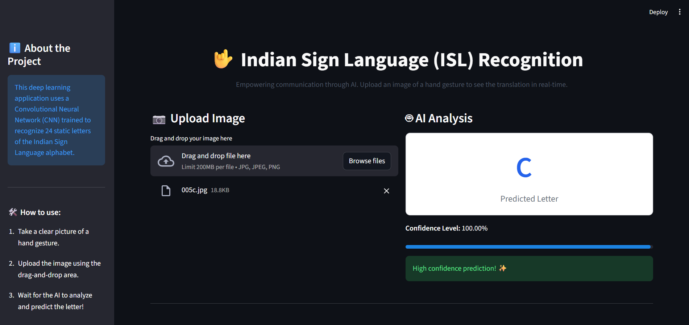

# Indian Sign Language (ISL) Recognition

## Project Overview
This project aims to bridge the communication gap for the hearing-impaired community by building a deep learning model capable of recognizing and classifying static Indian Sign Language (ISL) alphabets from images with high accuracy. 

It uses a Convolutional Neural Network (CNN) built with TensorFlow and Keras to classify 24 unique sign gestures.

## Features
- **Automated Data Acquisition:** The project script programmatically downloads and extracts the ISL dataset.
- **Data Augmentation:** Implements Image Data Generator with techniques like rotation, zoom, shear, and flipping to make the model robust.
- **CNN Architecture:** Custom-built Sequential CNN with multiple convolutional and max-pooling layers, a dropout layer to prevent overfitting, and a softmax output for 24-class classification.
- **Evaluation:** Includes detailed plotting for training accuracy/loss, a classification report, and confusion matrix analysis.

## Project Structure
- `project.ipynb`: Main Jupyter Notebook containing the code for data downloading, preprocessing, model training, and evaluation.
- `isl_recognition_model.h5`: Saved trained model.
- `*.jpg`: Sample images for demonstration.

## Screenshots
<p align="center">
  
  <br><br>
  
</p>

## Installation & Setup
1. Clone the repository:
   ```bash
   git clone <your-repository-url>
   cd <repository-folder>
   ```

2. Install the required dependencies:
   ```bash
   pip install -r requirements.txt
   ```

3. **Run the Streamlit Web App:**
   ```bash
   streamlit run app.py
   ```

4. Or run the Jupyter Notebook:
   ```bash
   jupyter notebook project.ipynb
   ```

## Note on Dataset
The dataset is downloaded automatically when you run the notebook. It will be extracted into a folder named `ISL_Data_Extracted`. This folder is ignored by git to keep the repository size small.
